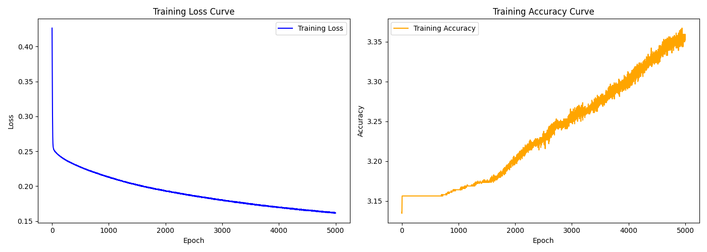

# traffic

smart traffic management with a feedforward neural network. this is a part of our theoretical final project (IDPA) at the Berufsmatura 2 TALS Luzern.

##  installation

```bash
pip install -r requirements.txt
```

## running static simulation

```bash
python3 static.py
```

## training model and evaluating / inference

```bash
python3 model.py
```

the model alogside the best performing epoch is then exported to output/ in the ```.safetensors``` format. after a successful training run, the model tries to solve the same simulation as static.py but instead of using the default periodic cycle update for the traffic lights, it will dynamically update the traffic lights based on the current traffic density and redlight counter. After inference, the script saves a log of all training epochs with their related training loss (the lower the better) and accuracy (the higher the better). Additionally it will save a plot of the training loss and accuracy as training.png under the current directory.

# training run with 5000 epochs

As you can see the training loss and accuracy rise respectively lower exponentially after a certain amount of epochs.



After successful inference, I could to achieve a result of 35 for the redlight-counter at the static simulation and a value of 24 for the feedforward nn-powered simulation. This is a efficiency increase of 31.5%!
